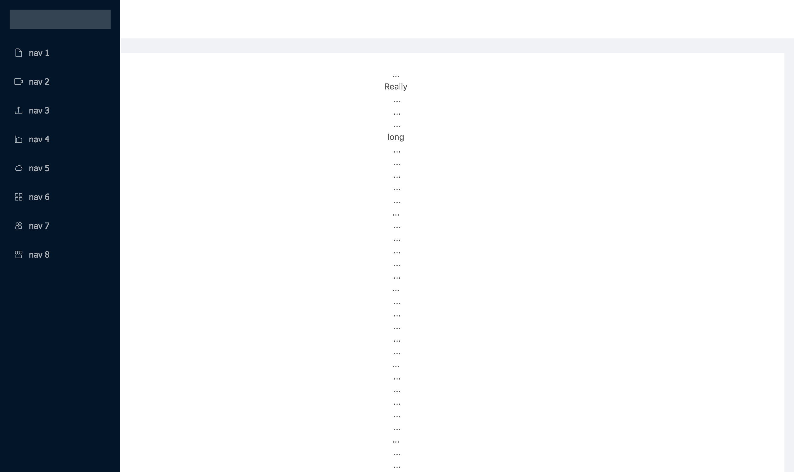

# NG ZORRO ANTD - Github Stars(教程)

## 开始之前

这是一篇介绍 NG-ZORRO 的入门教程，我们会一步一步的带你完成下面的应用。

TODO 最终应用截图


在开始本教程之前，我们需要你具备以下的基础知识：

- 包管理工具 `npm` 或者 `yarn` 的安装及使用方式。
- HTML、CSS 和 JavaScript 的中级知识。
- TypeScript 与 Angular 入门。

## 0 - 初始化项目

首先我们需要安装 [Angular CLI](https://cli.angular.io/) 它使我们不再需要配置繁琐的开发环境。构建、调试、代理、打包部署等一些列操作...

```base
npm install -g @angular/cli
```

新建一个名为 `nz-stars` Angular 项目设置样式扩展名为 `less`，并且生成路由模块。

```base
ng new nz-stars --style=less --routing
```

切换到 nz-stars 目录使用 `ng add `添加 NG-ZORRO。此命令会自动的为你初始化 NG-ZORRO。

```base
cd nz-stars
ng add ng-zorro-antd
```

运行项目, 在浏览器打开 http://localhost:4200

```base
ng serve -o # open your browser on http://localhost:4200/
```

当你在浏览器中看见下面的页面就说明我们可以继续下一步了

TODO 引导页截图

## 1 - 布局


这里我们会用 `ng generate` 命令，来快速生成组件。NG-ZORRO 现在有 **300+** 预设模板，你可以在[官网](https://ng.ant.design)中的任何一个组件DEMO中找到对于的命令拷贝按钮。

在命令行中输入下面的命令。

```base
ng g ng-zorro-antd:layout-top-side-2 -p app --styleext='less' --name=layout
```

**发生了什么**？我们使用 NG-ZORRO 提供的 `layout-top-side-2` 模板生成一个叫做 `layout` 的带侧边栏和顶部布局组件。并且为你声明在了 `app.module.ts` 中。

然后我们修改我们的 `app.component.html` 代码，替换成我们生成的 `layout` 组件。

***app.component.html***

```html
<app-layout></app-layout>
```

现在你的应用应该像下面这样。




## 2 - 添加组件

不管使用什么框架，我们都绕不开组件。很多入门阶段的同学对认为只有需要功能复用才分离成组件，其实不然。我认为在组件规划上 [关注点分离](https://zh.wikipedia.org/wiki/%E5%85%B3%E6%B3%A8%E7%82%B9%E5%88%86%E7%A6%BB) 应该我们首要考虑的目标。一个复杂的页面上通常包含多个业务逻辑。我们应该根据逻辑的复杂度和业务的关联性来进行组件拆分。这样我们在开发和今后维护时，只需要关注一小部分，而不至于担心其他逻辑。下面我们根据这个原则将来创建项目的组件：

- 用户面板
- 标签管理
- 搜索框
- 项目列表

### 2-0 打扫新房

让我们清理 `layout` 组件，为接下来的组件腾出位置。

**layout.component.html**

```html
<nz-layout class="layout">
  <nz-header class="header">
    <div class="title">Stars Manager</div>
    <div class="search-bar-wrap">
      <!--TODO 搜索框-->
    </div>
    <div class="user-pane-wrap">
      <!--TODO 用户面板-->
    </div>
  </nz-header>
  <nz-layout class="main">
    <nz-sider [nzWidth]="350" class="side">
      <div class="tags-wrap">
        <!--TODO 标签管理-->
      </div>
    </nz-sider>
    <nz-layout>
      <nz-content class="content">
        <div class="item-list-wrap">
          <!--TODO 项目列表-->
        </div>
      </nz-content>
    </nz-layout>
  </nz-layout>
</nz-layout>
```

**layout.component.less**

```less
@side-width: 350px; // 侧边栏宽度
@header-height: 64px; // 头部高度

.layout {
  width: 100%;
  height: 100%;
}

.header {
  position: fixed;
  z-index: 1;
  display: flex;
  top: 0;
  width: 100%;
  height: @header-height;
  background: #fff;
  box-shadow: 0 2px 8px #f0f1f2;

  .title {
    font-size: 20px;
    text-align: left;
    text-transform: uppercase;
    width: @side-width - 50;
  }

  .search-bar-wrap {
    flex: 1 1 auto;
  }

  .user-pane-wrap {
    height: 64px;
    max-width: 300px;
  }

}

.main {
  margin-top: @header-height;
  position: relative;

  .side {
    background: #fff;
    border-right: 1px solid #e9e9e9;
  }

  .content {
    height: 100%;
    overflow: auto;
    background: #fff;
  }

}
```


### 2-1 用户面板

命令行输入以下命令：

```base
ng g c user-panel # 生成 src/app/user-panel
```

修改下列文件内容

**layout.component.html**

```html
...
<div class="user-pane-wrap">
  <app-user-panel></app-user-panel>
</div>
...
```

 **user-panel.component.html**
 
 ```html
<nz-avatar nzIcon="anticon anticon-user"></nz-avatar>
<div class="username">用户名</div>
<div class="add-user">
  <a *ngIf="false">添加用户</a>
  <a>切换</a>
</div>
 ```
 

 **user-panel.component.less**
 
 ```less
 :host {
  display: flex;
  justify-content: flex-start;
  align-items: center;

  .username {
    margin: 0 10px;
    color: #595959;
    font-weight: 500;
    max-width: 200px;
    overflow: hidden;
    text-overflow: ellipsis;
    white-space: nowrap;
  }
}

 ```