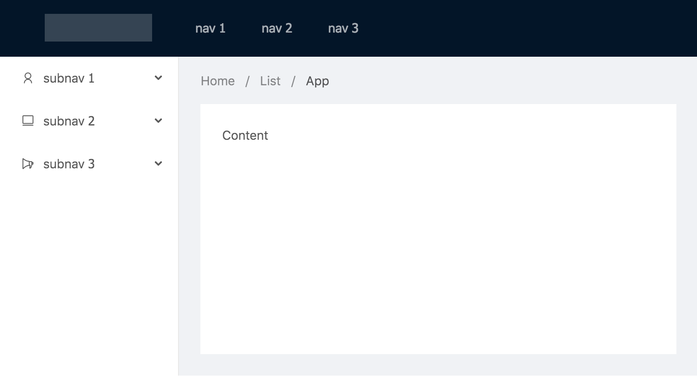

# 布局

## 使用 ng generate

这里我们会用 `ng generate` 命令，来快速生成组件。NG-ZORRO 现在有 **300+** 预设模板，你可以在[官网](https://ng.ant.design)中的任何一个组件DEMO中找到对于的命令拷贝按钮。

在命令行中输入下面的命令。

```base
ng g ng-zorro-antd:layout-top-side-2 -p app --styleext='less' --name=layout
```

**发生了什么**？我们使用 NG-ZORRO 提供的 `layout-top-side-2` 模板生成一个叫做 `layout` 的带侧边栏和顶部布局组件。并且为你声明在了 `app.module.ts` 中。

然后我们修改我们的 `app.component.html` 代码，替换成我们生成的 `layout` 组件。

***app.component.html***

```html
<app-layout></app-layout>
```

现在你的应用应该像下面这样。



我们只需要几个简单的命令就可以创建组件，接下来我们只需要在它的基础上进行开发。

## 打扫房间

现在让我们清理 `layout` 组件，为接下来的组件腾出位置，之后我们会再回来编辑它。

删除多余的 html，并且给每个部分添加 calss，用于调整样式。

**layout.component.html**

```html
<nz-layout class="layout">
  <nz-header class="header">
    <div class="title">Stars Manager</div>
    <div class="search-bar-wrap">
      <!--TODO 搜索框-->
    </div>
    <div class="user-pane-wrap">
      <!--TODO 用户面板-->
    </div>
  </nz-header>
  <nz-layout class="main">
    <nz-sider [nzWidth]="350" class="side">
      <div class="labels-wrap">
        <!--TODO 标签筛选-->
      </div>
    </nz-sider>
    <nz-layout>
      <nz-content class="content">
        <div class="item-list-wrap">
          <!--TODO 项目列表-->
        </div>
      </nz-content>
    </nz-layout>
  </nz-layout>
</nz-layout>
```

**layout.component.less**

```less
@side-width: 350px; // 侧边栏宽度
@header-height: 64px; // 头部高度

.layout {
  width: 100%;
  height: 100%;
}

.header {
  position: fixed;
  z-index: 1;
  display: flex;
  top: 0;
  width: 100%;
  height: @header-height;
  background: #fff;
  box-shadow: 0 2px 8px #f0f1f2;

  .title {
    font-size: 20px;
    text-align: left;
    text-transform: uppercase;
    width: @side-width - 50;
  }

  .search-bar-wrap {
    flex: 1 1 auto;
    padding-right: 36px
  }

  .user-pane-wrap {
    height: 64px;
    max-width: 300px;
  }

}

.main {
  margin-top: @header-height;
  position: relative;

  .side {
    background: #fff;
    border-right: 1px solid #e9e9e9;

    .labels-wrap {
      margin: 10px;
    }
  }

  .content {
    height: 100%;
    overflow: auto;
    background: #fff;

    .item-list-wrap {
      margin: 10px;
    }
  }

}
```

现在你的应用应该是一片空白，接下来我们来编写每个部分的组件。
