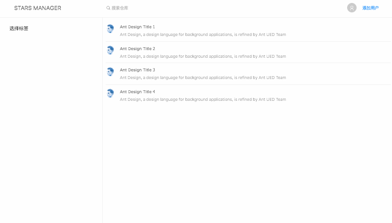
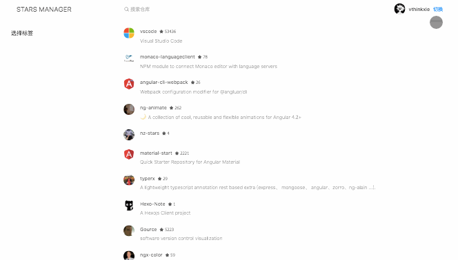

# 使用 GitHub API

## 添加服务

为了保持组件逻辑的清晰，我们将与视图无关的逻辑写在服务里面。比如共享的数据、API请求、数据的预处理等。

在我们添加服务之前，我们需要先对现在的目录结构进行调整。把服务与组件放在不同的文件夹中方便维护。在 `src/app` 下新建两个分别名为 `services` `components` 的文件夹。

然后将之前的组件全部移动到 `components` 内 (如果你使用的 IDE 没有重构功能，你还需要修改 `app.module.ts` 中的组件路径)。之后我们 `src` 的目录结构应该像下面这样：

```base
src
├── components
│   ├── item-list
│   ├── labels-filter
│   ├── layout
│   ├── search-bar
│   └── user-panel
├── services
├── app-routing.module.ts
├── app.component.html
├── app.component.less
├── app.component.spec.ts
├── app.component.ts
└── app.module.ts
```

下面我们就向 `services` 文件夹中添加我们所需的服务。

## 调用 GitHub API

除了我们定义的标签之外，其他数据都来源于 Github，我们现在新建一个服务用于处理它的请求。在控制台输入：

```base
ng g s services/github
```

Angualr CLI 会在 `services` 下创建一个 `github.service.ts` 文件。值得注意的是在 Angualr6 中，你不需要在模块中的 `providers` 字段中声明服务。相反，现在是在服务中的 `Injectable` 声明模块。默认会声明 `root` 模块，也就是说你在应用的任何地方都可以使用它。

为了处理 `http` 请求，我们需要将 `HttpClient` 类注入到 `GithubService` 中，就像下面这样：

**github.service.ts**

```ts
import { Injectable } from '@angular/core';
import { HttpClient } from '@angular/common/http';

@Injectable({
  providedIn: 'root'
})
export class GithubService {

  constructor(private http: HttpClient) { }
}
```

接下来前往 [https://developer.github.com/v3](https://developer.github.com/v3/?) 查看需要使用的API。我们主要会用到下面的 REST API:

- GET - [users/:username](https://developer.github.com/v3/users/#get-a-single-user) 获取用户信息
- GET - [users/:username/starred](https://developer.github.com/v3/activity/starring/#list-repositories-being-starred) 获取用户收藏的仓库

之后添加 `getUserInfo` 与 `getStarred` 两个请求方法。

```ts
import { Injectable } from '@angular/core';
import { HttpClient } from '@angular/common/http';

@Injectable({
  providedIn: 'root'
})
export class GithubService {

  API_URL = 'https://api.github.com';
  
  constructor(private http: HttpClient) { }

  getUserInfo(username) {
      return this.http.get(`${this.API_URL}/users/${username}`);
    }
  
  getStarred(username) {
    return this.http.get(`${this.API_URL}/users/${username}/starred`);
  }
}
```

## 绑定用户

现在我们修改 `UserPanelComponent` 组件，为他添加输入用户名以及显示用户信息的功能。

这里我们需要用到 NG-ZORRO 的 `nz-modal` 组件创建一个弹出框供用户输入用户名，之后再调用 `GithubService` 服务从线上获取用户信息。

**user-panel.component.ts**

```ts
import { Component, OnInit } from '@angular/core';
import { GithubService } from '../../services/github.service';

@Component({
  selector   : 'app-user-panel',
  templateUrl: './user-panel.component.html',
  styleUrls  : [ './user-panel.component.less' ]
})
export class UserPanelComponent implements OnInit {

  isVisible = false;
  isLoading = false;
  user: any;
  username: string;

  constructor(private githubService: GithubService) {
  }

  ngOnInit() {

  }

  openModal() {
    this.isVisible = true;
  }

  handleCancel() {
    this.isVisible = false;
  }

  handleOk() {
    this.isLoading = true;
    this.githubService.getUserInfo(this.username)
    .subscribe(res => {
      if (res.id) {
        this.user = res;
        this.isVisible = false;
      } else {
        this.user = null;
      }
      this.isLoading = false;
    }, () => {
      this.isLoading = false;
    });
  }
}
```

**user-panel.component.html**

```html
<nz-avatar nzIcon="anticon anticon-user" [nzSrc]="user?.avatar_url"></nz-avatar>
<div class="username">{{user?.login}}</div>
<div class="add-user">
  <a (click)="openModal()">{{user ? '切换' : '添加用户'}}</a>
</div>
<nz-modal [(nzVisible)]="isVisible" nzTitle="绑定用户" (nzOnCancel)="handleCancel()" (nzOnOk)="handleOk()" [nzOkLoading]="isLoading">
  <input type="text" nz-input placeholder="输入你的 GitHub 用户名" [(ngModel)]="username">
</nz-modal>
```

效果如下图



## 跨组件通信

现在我们面临一个问题。我们如何在 `UserPanelComponent` 组件添加用户之后，通知其它组件作出响应呢？如果仅仅是一个控制某些值的组件我们可以通过 `@Output` 向外发出事件。但是这里的 `user` 关系到整个应用的状态。

所以我们可以在这种情况下使用 RxJs 的 `Subject` 来将值发送给它的订阅者。

首先我们添加 Authentication 服务，这里只是象征意义的使用它。在真实的应用中，这个服务大多用于储存当前用户信息、管理用户权限、管理 token 等...

在控制台输入以下命令生成 `AuthService`:

```base
ng g s services/auth
```

并且添加如下内容:

**auth.service.ts**

```ts
import { Injectable } from '@angular/core';
import { Subject } from 'rxjs/internal/Subject';

@Injectable({
  providedIn: 'root'
})
export class AuthService {

  username: string;
  addUser = new Subject<string>();

  constructor() { }

  registerUsername(username: string) {
    this.username = username;
    this.addUser.next(username);
  }

}
```

接下来在 `UserPanelComponent` 注入服务，在获取用户信息成功后调用 `registerUsername` 方法。

**user-panel.component.ts**

```ts
import { Component, OnInit } from '@angular/core';
import { GithubService } from '../../services/github.service';
import { AuthService } from '../../services/auth.service';

@Component({
  selector   : 'app-user-panel',
  templateUrl: './user-panel.component.html',
  styleUrls  : [ './user-panel.component.less' ]
})
export class UserPanelComponent implements OnInit {

  isVisible = false;
  isLoading = false;
  user: any;
  username: string;

  constructor(private githubService: GithubService, private authService: AuthService) {
  }

  ngOnInit() {

  }

  openModal() {
    this.isVisible = true;
  }

  handleCancel() {
    this.isVisible = false;
  }

  handleOk() {
    this.isLoading = true;
    this.githubService.getUserInfo(this.username)
    .subscribe(res => {
      if (res.id) {
        this.user = res;
        this.isVisible = false;
        this.authService.registerUsername(this.username);
      } else {
        this.user = null;
      }
      this.isLoading = false;
    }, () => {
      this.isLoading = false;
    });
  }
}
```

在 `GithubService` 中注入服务，然后在 `getStarred` 方法中使用 `AuthService` 的 `username` 属性。

**github.service.ts**

```ts
import { Injectable } from '@angular/core';
import { HttpClient } from '@angular/common/http';
import { AuthService } from './auth.service';

@Injectable({
  providedIn: 'root'
})
export class GithubService {

  API_URL = 'https://api.github.com';

  constructor(private http: HttpClient, private authService: AuthService) { }

  getUserInfo(username) {
    return this.http.get<any>(`${this.API_URL}/users/${username}`);
  }

  getStarred() {
    return this.http.get<any>(`${this.API_URL}/users/${this.authService.username}/starred`);
  }
}
```

## 获取列表

最后在 `ItemListComponent` 组件中订阅 `addUser`，并调用 `getStarred` 方法，获取用户 starred 的库，并且循环渲染在页面上。

**item-list.component.ts**

```ts
import { Component, OnDestroy } from '@angular/core';
import { AuthService } from '../../services/auth.service';
import { GithubService } from '../../services/github.service';
import { Subscription } from "rxjs";

@Component({
  selector: 'app-item-list',
  templateUrl: './item-list.component.html'
})
export class ItemListComponent implements OnDestroy {
  data = [];

  addUserSubscription: Subscription;

  constructor(private authService: AuthService, private githubService: GithubService) {
    this.addUserSubscription = this.authService.addUser.subscribe(() => this.getStarredRepo());
  }

  getStarredRepo() {
    this.githubService.getStarred()
    .subscribe(res => {
      this.data = res;
      console.log(this.data);
    })
  }

  ngOnDestroy(): void {
    if (this.addUserSubscription) {
      this.addUserSubscription.unsubscribe()
    }
  }
}
```

**item-list.component.html**

```html
<nz-list [nzDataSource]="data" [nzRenderItem]="item" [nzItemLayout]="'horizontal'">
  <ng-template #item let-item>
    <nz-list-item>
      <nz-list-item-meta
        [nzTitle]="nzTitle"
        [nzAvatar]="item.owner.avatar_url"
        [nzDescription]="item.description">
        <ng-template #nzTitle>
          <a [href]="item.url">{{item.name}}</a>&nbsp;
          <small><i class="anticon anticon-star"></i> {{item.stargazers_count}}</small>
        </ng-template>
      </nz-list-item-meta>
    </nz-list-item>
  </ng-template>
</nz-list>
```

最终效果如下



## 自动分页

[users/:username/starred](https://developer.github.com/v3/activity/starring/#list-repositories-being-starred) 接口每次最多只能获取 100 条数据，而我们之后要实现本地的标签分类与本地搜索，所以我们实现自动分页需要获取用户全部的收藏。

与传统的分页接口不同，GitHub API 的分页是按照 [Web Linking](https://tools.ietf.org/html/rfc5988) 放在 Response Headers 的 `Link` 字段中：

```http
Link: <https://api.github.com/user/22736418/starred?page=2>; rel="next", <https://api.github.com/user/22736418/starred?page=13>; rel="last"
```

所以我门需要解析 `Link` 字段，并获取总条数，再自动的发起分页请求获取所有数据后返回。这里我们需要一个第三方库 [parse-link-header](https://github.com/thlorenz/parse-link-header) 用于解析，在控制台输入以下命令安装:

```base
$ npm i parse-link-header
$ npm i @types/parse-link-header -D
```

之后修改我们的 `getStarred` 方法，在数据返回后解析 `Link` 字段判断是否有多页，如果存在多页则循环创建多个 `Observable`，然后使用 `concatAll` 操作符链接；最后使用 `reduce` 操作符将结果合并返回。

**github.service.ts**

```ts
import { Injectable } from '@angular/core';
import { HttpClient, HttpResponse } from '@angular/common/http';

import * as parse from 'parse-link-header';

import { AuthService } from './auth.service';

import { from, of } from 'rxjs';
import { concatAll, mergeMap, reduce } from 'rxjs/operators';

@Injectable({
  providedIn: 'root'
})
export class GithubService {

  API_URL = 'https://api.github.com';

  constructor(private http: HttpClient, private authService: AuthService) {
  }

  getUserInfo(username) {
    return this.http.get<any>(`${this.API_URL}/users/${username}`);
  }

  getStarred(index: number = 1) {
    return this.http.get<any[]>(
      `${this.API_URL}/users/${this.authService.username}/starred?per_page=100&page=${index}`,
      { observe: 'response' }
    ).pipe(
      mergeMap((res: HttpResponse<any>) => {
        const link = parse(res.headers.get('Link'));
        if (index === 1 && link && link.next && link.last) {
          const page = parseInt(link.last.page, 10);
          const observables = [];
          for (let i = 1; i < page; i++) {
            observables.push(this.getStarred(i + 1));
          }
          return from([of(res.body), ...observables]).pipe(concatAll());
        } else {
          return from(of(res.body));
        }
      }),
      reduce((total: any[], current: any[]): any[] => [...total, ...current])
    );
  }
}
```


