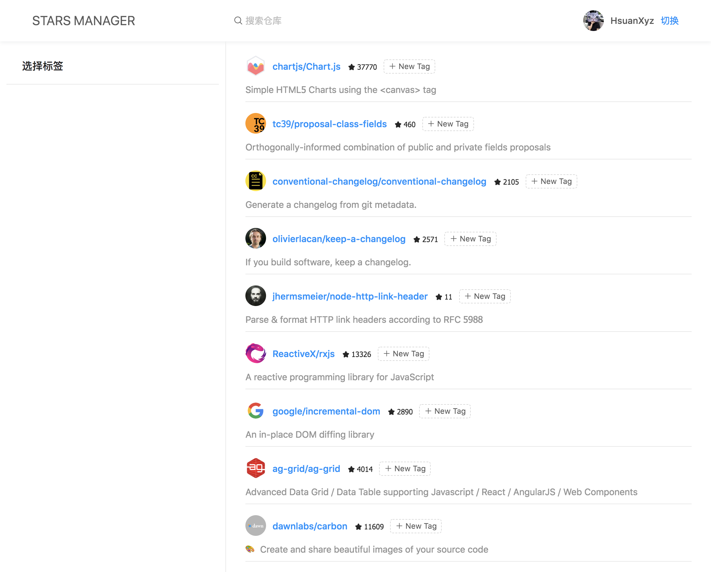

# 标签管理

## 为每个库添加标签组件

这里我们要为每一个 item 添加一个增删标签的组件，在命令后输入以下命令(注意: 这里使用 `--path` 参数指的了组件路径):

```base
$ ng g ng-zorro-antd:tag-control -p app --styleext='less' --name=item-tags --path=src/app/components
```

接下来修改组件，为其然增加一个 `id` 输入属性，用于控制这个 repo 的 tags。然后修改以下生成模板中的条件判断

**item-tags.component.ts**

```ts
import { Component, ElementRef, Input, ViewChild } from '@angular/core';

@Component({
  selector: 'app-item-tags',
  templateUrl: './item-tags.component.html',
  styleUrls: ['./item-tags.component.less'],
})
export class ItemTagsComponent {

  tags = [];
  inputVisible = false;
  inputValue = '';
  @Input() id: number;
  @ViewChild('inputElement') inputElement: ElementRef;

  handleClose(removedTag: {}): void {
    this.tags = this.tags.filter(tag => tag !== removedTag);
  }

  sliceTagName(tag: string): string {
    const isLongTag = tag.length > 20;
    return isLongTag ? `${tag.slice(0, 20)}...` : tag;
  }

  showInput(): void {
    this.inputVisible = true;
    setTimeout(() => {
      this.inputElement.nativeElement.focus();
    }, 10);
  }

  handleInputConfirm(): void {
    if (this.inputValue && this.tags.indexOf(this.inputValue) === -1) {
      this.tags.push(this.inputValue);
    }
    this.inputValue = '';
    this.inputVisible = false;
  }
}
```

**item-tags.component.html**

```html
<nz-tag
  *ngFor="let tag of tags"
  [nzMode]="'closeable'"
  (nzAfterClose)="handleClose(tag)">
  {{ sliceTagName(tag) }}
</nz-tag>
<nz-tag
  *ngIf="!inputVisible"
  class="editable-tag"
  (click)="showInput()">
  <i class="anticon anticon-plus"></i> New Tag
</nz-tag>
<input
  #inputElement
  nz-input
  nzSize="small"
  *ngIf="inputVisible" type="text"
  [(ngModel)]="inputValue"
  style="width: 78px;"
  (blur)="handleInputConfirm()"
  (keydown.enter)="handleInputConfirm()">
```

调整样式

**item-tags.component.less**

```less
.editable-tag ::ng-deep .ant-tag {
  background: rgb(255, 255, 255);
  border-style: dashed;
}

::ng-deep .ant-tag {
  margin-bottom: 0;
}
```

将其放入 `ItemListComponent` 组件的模板循环体中，然后将 `id` 属性传给标签组件。

**item-list.component.html**

```html
<nz-spin nzTip='Loading...' [nzSpinning]="loading">
  <ul class="list">
    <li class="item" *ngFor="let item of data">
      <div class="title-wrap">
        <nz-avatar class="avatar" nzIcon="anticon anticon-user" [nzSrc]="item.owner.avatar_url"></nz-avatar>
        <h4 class="title">
          <a [href]="item.html_url" target="_blank">{{item.full_name}}</a> &nbsp;
          <small><i class="anticon anticon-star"></i> {{item.stargazers_count}}</small>
        </h4>
        <app-item-tags [id]="item.id"></app-item-tags>
      </div>
      <p class="description">{{item.description}}</p>
    </li>
  </ul>
</nz-spin>
```

不出意外的话，你的界面应该像下面这样。



你现在可以尝试点击 `New Tag` 按钮增加标签，当然，现在只实现了交互效果，并没有实质性的作用。

接下来我们会编写标签服务来控制标签的增删查，最后会在添加通过标签筛选的功能。

## 标签管理服务

这里我们会使用本地储存来管理用户自定义标签，当然免不了设计存储的数据结构。所以和之前一样，我们需要为其声明 Interface。

在命令行输入以下命令，并编写以下文件内容：

```base
$ ng g interface interfaces/repo-tags
```


本章我们会完成标签的增删查功能，因为 GitHub 没有自定义标签的功能，所以我需要编写一个服务储存与用户相关联的标签。

## 使用 localStorage

这里我们使用 [localStorage](https://developer.mozilla.org/zh-CN/docs/Web/API/Window/localStorage) 在本地存取用户标签。

在命令行输入以下命令创建一个 `LabelService` 服务:

```base
ng g s services/label
```

编辑 `LabelService`，添加一个 `prefix` 属性用于指定 `localStorage` key 的前缀，这是避免命名冲突的最佳实践；然后注入 `AuthService` 服务，用于获取当前用户名，以区分不同用户的标签。

**label.service.ts**

```ts
import { Injectable } from '@angular/core';
import { AuthService } from './auth.service';

@Injectable({
  providedIn: 'root'
})
export class LabelService {

  prefix = 'ng-stars';
  
  constructor(private authService: AuthService) { }
}
```

然后添加 `setLabels` 与 `getLabels` 方法，以用户名作为作用域存取标签。

**label.service.ts**

```ts
import { Injectable } from '@angular/core';
import { AuthService } from './auth.service';

@Injectable({
  providedIn: 'root'
})
export class LabelService {

  prefix = 'ng-stars';

  constructor(private authService: AuthService) { }

  setLabels(labels: string[]) {
    const username = this.authService.username;
    localStorage.setItem(`${this.prefix}-${username}/labels`, JSON.stringify(labels));
  }

  getLabels(): string[] | null {
    const username = this.authService.username;
    return JSON.parse(localStorage.getItem(`${this.prefix}-${username}/labels`));
  }
}
```

## 添加标签

### 使用可编辑标签组件

TODO 为列表 item 添加一个带添加移除的标签组件

### 修改储存数据结构

TODO 使用标签作为 key, 对应的 repo 数组作为 value

### 显示标签

TODO 在左侧显示当前用户标签

## 移除标签

TODO 在列表 item 上移除标签，当标签对应 repo length 为 0 时移除次标签

## 通过标签筛选

TODO 是通过管道吗？还是缓存完整列表通过服务完成？
