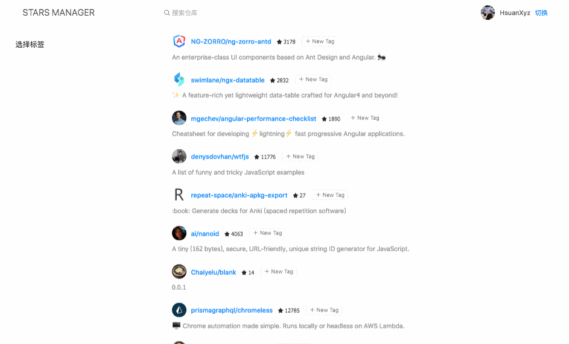

# 标签管理

## 标签管理服务

这里我们会使用本地储存来管理用户自定义标签，当然免不了设计存储的数据结构。所以和之前一样，我们需要为其声明 Interface。

在命令行输入以下命令，并编写以下文件内容：

```base
$ ng g interface interfaces/repo-tags
```

**repo-tags.ts**

```
export interface RepoTags {
  repos: Repos;
  tags: Tag[];
}

export interface Repos {
  [id: number]: string[];
}

export interface Tag {
  name: string;
  repos: number[];
  count: number;
}
```

这里的 `repos` 属性和 `tags` 属性其实是互相映射的关系。这里我们是在用空间换时间，因为在数据量很大的时候，特别是在 Angular 模板的循环体中反查对应数据是消耗性能的。没明白的同学等我们做完之后再慢慢体会。

这里我们会使用 [localForage](https://github.com/localForage/localForage) 来操作本地存储，它会自动的根据浏览器支持选择 `IndexedDB` > `WebSQL` > `localStorage` 作为存储方案。这里我们是希望通过 `IndexedDB` 的异步存取来改善性能，而使用 `localForage` 时，它的用法几乎与使用 `localStorage` 一样。

在命令输入 `npm install localforage` 安装，然后在 `app.module.ts` 中调用 `localforage.config` 方法配置存储前缀，这是有效避免命名冲突的最佳实践。

**app.module.ts**

```ts
...
import localForage from "localforage";

localForage.config({
  name: 'nz-stars',
  storeName: 'nz-stars'
});
```

接下来在命令行输入以下命令创建标签服务：

```base
ng g s services/tags
```

然后为其添加如下方法:

**tags.service.ts**

```ts
import { Injectable } from '@angular/core';

import localForage from "localforage";

import { AuthService } from './auth.service';
import { RepoTags } from "../interfaces/repo-tags";

import { Subject } from 'rxjs/internal/Subject';

@Injectable({
  providedIn: 'root'
})
export class TagsService {

  tagsCache: {
    tags: RepoTags,
    username: string
  };

  tagChange = new Subject<RepoTags>();

  get hasCache(): boolean {
    return this.tagsCache && this.tagsCache.username === this.authService.username
  }

  constructor(private authService: AuthService) {
  }


  getTags(): Promise<RepoTags> {
    const username = this.authService.username;

    // 如果有缓存则使用缓存
    if (this.hasCache) {
      return Promise.resolve(this.tagsCache.tags);
    }

    return localForage.getItem(`{${username}/tags`)
    .then((tags: RepoTags) => {
      this.tagsCache = {
        tags,
        username
      };
      return Promise.resolve(tags);
    })
  }

  addTag(tag: string, repoId: number) {
    const username = this.authService.username;
    return this.getTags().then(tags => {
      const newTags: RepoTags = tags ? tags : { repos: {}, tags: [] };
      const tagIndex = newTags.tags.findIndex(item => item.name === tag);

      if (newTags.repos[repoId]) {
        newTags.repos[repoId].push(tag);
      } else {
        newTags.repos[repoId] = [tag];
      }

      if (tagIndex !== -1) {
        newTags.tags[tagIndex].repos.push(repoId);
        newTags.tags[tagIndex].count = newTags.tags[tagIndex].repos.length;
      } else {
        newTags.tags.push({
          name: tag,
          repos: [repoId],
          count: 1
        })
      }
      this.tagsCache = {
        tags: newTags,
        username
      };
      this.tagChange.next(newTags);
      return localForage.setItem(`{${username}/tags`, newTags);
    })
  }

  removeTag(tag: string, repoId: number) {
    const username = this.authService.username;
    return this.getTags().then(tags => {
      const newTags: RepoTags = tags ? tags : { repos: {}, tags: [] };
      const tagIndex = newTags.tags.findIndex(item => item.name === tag);

      if (newTags.repos[repoId]) {
        const tagIndexInRepo = newTags.repos[repoId].indexOf(tag);
        newTags.repos[repoId].splice(tagIndexInRepo, tagIndexInRepo !== -1 ? 1 : 0);
      } else {
        newTags.repos[repoId] = [];
      }

      if (tagIndex !== -1) {
        const repoIndexInTag = newTags.tags[tagIndex].repos.indexOf(repoId);
        const count = newTags.tags[tagIndex].count;

        if (newTags.tags.length === 1 && repoIndexInTag !== -1) {
          // 如果这是唯一一个 tag 则直接移除它。
          newTags.tags.splice(repoIndexInTag, 1);
        } else if (repoIndexInTag !== -1) {
          newTags.tags[tagIndex].repos.splice(repoIndexInTag, 1);
          newTags.tags[tagIndex].count = newTags.tags[tagIndex].repos.length;
        }
      }

      this.tagsCache = {
        tags: newTags,
        username
      };
      
      this.tagChange.next(newTags);
      return localForage.setItem(`{${username}/tags`, newTags);
    })
  }

}
```

这里有几点需要注意：

* 使用了当前用户作为存储 key 的前缀，用于区分不同用户的自定义标签；
* 在第一次获取，以及发生改动后都对数据进行了内存缓存，这比每次读取本地存储快得多。
* 每次发生改动后调用了 `tagChange` 进行广播，方便相关组件刷新数据。

## 列表标签组件

接下来我们要为每一个 item 添加一个增删标签的组件，在命令后输入以下命令(注意: 这里使用 `--path` 参数指的了组件路径):

```base
$ ng g ng-zorro-antd:tag-control -p app --styleext='less' --name=item-tags --path=src/app/components
```

接下来修改 `ItemTagsComponent` 组件。 

**item-tags.component.ts**

```ts
import { Component, ElementRef, Input, ViewChild } from '@angular/core';
import { TagsService } from '../../services/tags.service';

@Component({
  selector       : 'app-item-tags',
  templateUrl    : './item-tags.component.html',
  styleUrls      : [ './item-tags.component.less' ],
})
export class ItemTagsComponent {

  inputVisible = false;
  inputValue = '';
  _tags: string[] = [];

  @Input() id: number;
  @Input()
  set tags(value: string[]) {
    this._tags = [...value];
  }
  get tags(): string[] {
    return this._tags;
  }

  @ViewChild('inputElement') inputElement: ElementRef<HTMLInputElement>;

  constructor(private tagsService: TagsService) {

  }

  handleClose(removedTag: string): void {
    this.tagsService.removeTag(removedTag, this.id)
    .then(() => {
      this._tags = this._tags.filter(tag => tag !== removedTag);
    });
  }

  showInput(): void {
    this.inputVisible = true;
    setTimeout(() => {
      if (this.inputElement && this.inputElement.nativeElement) {
        this.inputElement.nativeElement.focus();
      } else {
        this.inputVisible = false;
      }
    }, 10);
  }

  handleInputConfirm(): void {
    if (!this.inputValue) {
      this.inputValue = '';
      this.inputVisible = false;
      return;
    }
    if (this._tags.indexOf(this.inputValue) === -1) {
      this.tagsService.addTag(this.inputValue, this.id)
      .then(() => {
        this._tags.push(this.inputValue);
        this.inputValue = '';
        this.inputVisible = false;
      });
    }
  }
}
```

**item-tags.component.html**

```html
<nz-tag
  *ngFor="let tag of tags"
  [nzMode]="'closeable'"
  (nzAfterClose)="handleClose(tag)">
  {{ tag }}
</nz-tag>
<nz-tag
  *ngIf="!inputVisible"
  class="editable-tag"
  (click)="showInput()">
  <i class="anticon anticon-plus"></i> New Tag
</nz-tag>
<input
  #inputElement
  nz-input
  nzSize="small"
  maxlength="20"
  *ngIf="inputVisible" type="text"
  [(ngModel)]="inputValue"
  style="width: 78px;"
  (blur)="handleInputConfirm()"
  (keydown.enter)="handleInputConfirm()">
```

**item-tags.component.less**

```less
:host {
  .editable-tag ::ng-deep .ant-tag {
    background: rgb(255, 255, 255);
    border-style: dashed;
  }

  ::ng-deep .ant-tag {
    margin: 4px;
  }
}
```

将其放入 `ItemListComponent` 组件的模板循环体中。

**item-list.component.html**

```html
<nz-spin nzTip='Loading...' [nzSpinning]="loading">
  <ul class="list">
    <li class="item" *ngFor="let item of data">
      <div class="title-wrap">
        <nz-avatar class="avatar" nzIcon="anticon anticon-user" [nzSrc]="item.owner.avatar_url"></nz-avatar>
        <h4 class="title">
          <a [href]="item.html_url" target="_blank">{{item.full_name}}</a> &nbsp;
          <small><i class="anticon anticon-star"></i> {{item.stargazers_count}}</small>
        </h4>
        <app-item-tags></app-item-tags>
      </div>
      <p class="description">{{item.description}}</p>
    </li>
  </ul>
</nz-spin>
```

不出意外的话，你的界面应该像下面这样。


## 绑定标签

修改 `ItemListComponent` 组件的 `getStarredRepo` 方法，在获取数据后调用数组 `map` 方法，将对于标签添加到数据中，同时修改 `data` 属性的类型，为其添加 `tags` 属性。
注意，这里我们使用 `&` 符号在 `GithubRepo` 类型中加入了 `tags`。
**item-list.component.ts**

```ts
import { Component, OnDestroy } from '@angular/core';
import { AuthService } from '../../services/auth.service';
import { GithubService } from '../../services/github.service';
import { Subscription } from 'rxjs';
import { GithubRepo } from '../../interfaces/github';
import { TagsService } from '../../services/tags.service';

@Component({
  selector: 'app-item-list',
  templateUrl: './item-list.component.html',
  styleUrls: ['./item-list.component.less']
})
export class ItemListComponent implements OnDestroy {
  data: Array<GithubRepo & { tags: string[] }> = [];
  loading = false;

  addUserSubscription: Subscription;

  constructor(private authService: AuthService, private githubService: GithubService, private tagsService: TagsService) {
    this.addUserSubscription = this.authService.addUser.subscribe(() => this.getStarredRepo());
  }

  getStarredRepo() {
    this.loading = true;
    this.tagsService.getTags()
    .then(tags => {
      this.githubService.getStarred()
      .subscribe(res => {
        this.data = res.map(repo => {
          return {
            ...repo,
            tags: tags.repos[repo.id] || []
          };
        });
        this.loading = false;
      });
    });
  }

  ngOnDestroy(): void {
    if (this.addUserSubscription) {
      this.addUserSubscription.unsubscribe();
    }
  }
}
```

修改模版，将 `id` 和 `tags` 传给 `ItemTagsComponent` 组件了。

**item-list.component.html**

```html
<nz-spin nzTip='Loading...' [nzSpinning]="loading">
  <ul class="list">
    <li class="item" *ngFor="let item of data">
      <div class="title-wrap">
        <nz-avatar class="avatar" nzIcon="anticon anticon-user" [nzSrc]="item.owner.avatar_url"></nz-avatar>
        <h4 class="title">
          <a [href]="item.html_url" target="_blank">{{item.full_name}}</a> &nbsp;
          <small><i class="anticon anticon-star"></i> {{item.stargazers_count}}</small>
        </h4>
        <app-item-tags [tags]="item.tags" [id]="item.id"></app-item-tags>
      </div>
      <p class="description">{{item.description}}</p>
    </li>
  </ul>
</nz-spin>
```

现在你可以尝试点击 `New Tag` 按钮，将标签添加到指定库，刷新页面重新请求列表时标签依然存在。

## 显示标签全部

现在我们修改 `TagsFilterComponent` 组件，让它显示当前用户的全部标签。

这里我们使用 `merge` 合并了两个 `Observable`，分布对应绑定用户和修改标签，并重新获取标签列表。

**tags-filter.component.ts**

```ts
import { Component, EventEmitter, Output } from '@angular/core';
import { merge } from 'rxjs';

import { Tag } from '../../interfaces/repo-tags';
import { AuthService } from '../../services/auth.service';
import { TagsService } from '../../services/tags.service';

@Component({
  selector: 'app-tags-filter',
  templateUrl: './tags-filter.component.html',
  styleUrls: ['./tags-filter.component.less']
})
export class TagsFilterComponent {

  selectedTags: Tag[] = [];
  tags: Tag[] = [];
  @Output() select = new EventEmitter<Tag[]>();

  constructor(private authService: AuthService, private tagsService: TagsService) {
    merge(
      this.authService.addUser,
      this.tagsService.tagChange
    ).subscribe(() => {
      this.getTags();
    });
  }

  getTags() {
    this.tagsService.getTags()
      .then(tags => {
        this.tags = tags.tags;
      });
  }

  handleChange(checked: boolean, tag: Tag): void {
    if (checked) {
      this.selectedTags.push(tag);
    } else {
      this.selectedTags = this.selectedTags.filter(t => t !== tag);
    }
    this.select.emit(this.selectedTags);
  }

}
```

**tags-filter.component.html**

```html
<nz-card [nzBordered]="false" nzTitle="选择标签">
  <nz-tag *ngFor="let tag of tags" nzMode="checkable"
          [nzChecked]="selectedTags.indexOf(tag) > -1" (nzCheckedChange)="handleChange($event, tag)">
    {{ tag.name }} <small>({{tag.count}})</small>
  </nz-tag>
</nz-card>
```

现在你的左侧标签和右侧列表应该同步显示了，就像下面这样



## 总结

// TODO
